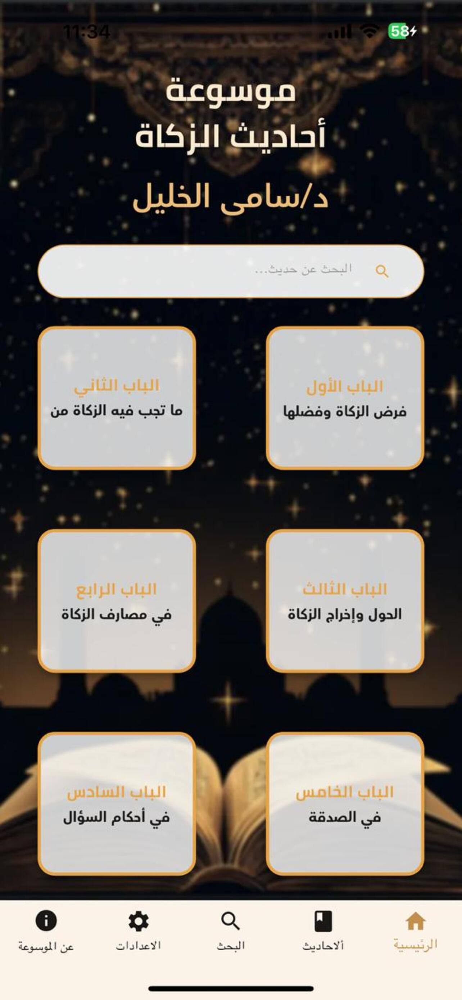
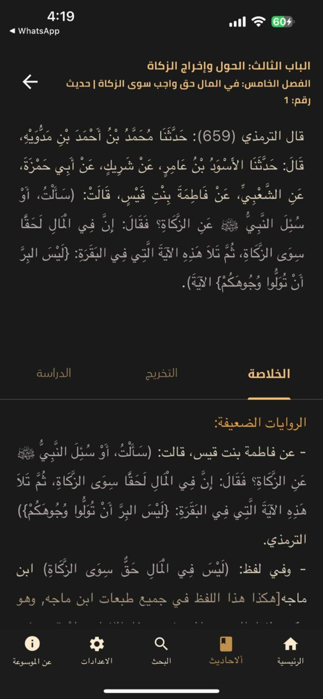

# Ahadith Al-Zakah - Flutter App 📱

**Ahadith Al-Zakah** is the first mobile encyclopedia, to our knowledge, that includes all the Hadiths related to *Zakat* (charitable giving in Islam). The Hadiths are critically studied and thoroughly verified using a detailed and rigorous academic methodology.

## Features ✨
- **Complete Collection**: All authenticated Hadiths about Zakat in one place.
- **Structured Content**:
  - Organized into **Chapters** (Books)
  - Each chapter contains **Sections** (Categories)
  - Each section contains numbered **Ahadith** that have **Summary**, **Reference**, and **Analysis**
- **Dark/Light Theme**: Switch between themes for comfortable reading.
- **Search Functionality**: Easily find specific Hadiths by keywords.
- **Cross-Platform**: Available for both **Android** and **iOS**.

## Screenshots 📸

| Home                          | Hadith View                       | Search                            |
|-------------------------------|-----------------------------------|-----------------------------------|
|  |  |  |

### Android
Available on Google Play

### iOS
Available on the App Store
